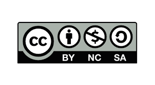

# DeepMIR
Teaching material for the course (CommE5070) "Deep Learning for Music Analysis and Generation" I taught at National Taiwan University (2023 Fall).
https://affige.github.io/teaching.html

Lecturer: Yi-Hsuan Yang (https://affige.github.io/; affige@gmail.com)

“Music Information Research” (MIR) is an interdisciplinary research field that concerns with the analysis, retrieval, processing, and generation of musical content or information. Researchers involved in MIR may have a background in signal processing, machine learning, information retrieval, human-computer interaction, musicology, psychoacoustics, psychology, or some combination of these.

In this course, we are mainly interested in the application of machine learning, in particular deep learning, to address music related problems. Specifically, the course is divided to two parts: analysis and generation.

The first part is about the **analysis** of musical audio signals, covering topics such as feature extraction and representation learning for musical audio, music audio classification, melody extraction, automatic music transcription, and musical source separation.

The second part is about the **generation** of musical material, including symbolic-domain MIDI or tablatures, and audio-domain music signals such as singing voices and instrumental music. This would involve deep generative models such as generative adversarial networks (GANs), variational autoencoders (VAE), Transformers, and diffusion models. 

# Syllabus
* Lecture 1. Introduction to the course ([slides1](https://github.com/affige/DeepMIR/blob/main/lecture01_intro_course.pdf), [slides2](https://github.com/affige/DeepMIR/blob/main/lecture01b_intro_MIR.pdf))
* Lecture 2. Fundamentals & Music representation ([slides](https://github.com/affige/DeepMIR/blob/main/lecture02_representations.pdf))
* Lecture 3. Analysis I (timbre): Automatic music classification and representation learning ([slides](https://github.com/affige/DeepMIR/blob/main/lecture03_timbre.pdf))
* Lecture 4. Generation I: Source separation ([slides](https://github.com/affige/DeepMIR/blob/main/lecture04_separation.pdf))
* Lecture 5. Generation II: GAN & Vocoders ([slides](https://github.com/affige/DeepMIR/blob/main/lecture05_vocoders.pdf))
* Lecture 6. Generation III: Synthesis of notes and loops ([slides](https://github.com/affige/DeepMIR/blob/main/lecture06_synthesis.pdf))
* Lecture 7. Analysis II (pitch): Music transcription, Melody extraction, and Chord Recognition ([slides1](https://github.com/affige/DeepMIR/blob/main/lecture07_pitch.pdf), [slides2](https://github.com/leo-so/AMT_talk))
*	Lecture 8. Generation IV: Symbolic MIDI generation ([slides](https://github.com/affige/DeepMIR/blob/main/lecture08_midi_generation.pdf))
*	Lecture 9. Generation V: Symbolic MIDI generation: Advanced topic on music structure ([slides](https://github.com/affige/DeepMIR/blob/main/lecture09_midi_generation_2.pdf))
*	Lecture 10. Generation VI: Singing voice generation ([slides](https://github.com/affige/DeepMIR/blob/main/lecture10_singing_generation.pdf))
* Lecture 11. Generation VII: Text-to-music generation ([slides](https://github.com/affige/DeepMIR/blob/main/lecture11_text-to-music.pdf))
*	Lecture 12. Generation VIII: Differentiable DSP models and automatic mixing ([slides](https://github.com/affige/DeepMIR/blob/main/lecture12_DDSP_mixing.pdf))
*	Lecture 13. Analysis III (rhythm) ([slides](https://github.com/affige/DeepMIR/blob/main/lecture13_rhythm.pdf))

# License
The slides are licensed under a Creative Commons Attribution-NonCommercial-ShareAlike 4.0 International License (https://creativecommons.org/licenses/by-nc-sa/4.0/). By downloading the slides, you agree to this license.

